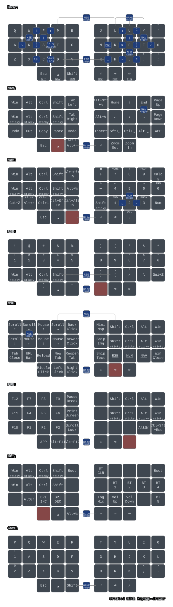

# zmk-config-charybdis-36

ZMK config for a Charybdis-family split keyboard, **36 keys** (5 cols x 3 rows
per half + 3 thumbs per half), integrated **PMW3610 trackball under the right
thumb**, no rotary encoders, no RGB underglow. BLE name: **Nano36**.

## Hardware

- Controller: nice!nano-compatible nRF52840 clone → board `nice_nano_v2`
- Wireless split, no dongle: right half (trackball side) is the BLE central
- Trackball: PMW3610, mounted under the right thumb cluster (not the palm)
- Base config forked from [Vzhao-L/zmk-for-charybdis](https://github.com/Vzhao-L/zmk-for-charybdis)
  branch `charybdis-Nano35-MOD` — despite the branch's internal `Nano35_layout`
  label (kept as `Nano36_layout` here), its physical layout is genuinely 36
  keys (5x3+3 per side), matching this board exactly. The sibling branch
  `Charybdis-mini36-Mod` looked promising at first but turned out to be a
  different, larger 42-key PCB — ruled out by comparing physical layouts
  key-by-key.
- ZMK pinned to `v0.3` and `zmk-pmw3610-driver` (DoctorWangWang fork) pinned
  to an exact commit instead of floating `main` (see `config/west.yml`).

## Keymap

*Auto-generated by [keymap-drawer](https://github.com/caksoylar/keymap-drawer)
on every push that touches `config/` (see `.github/workflows/doc.yml`) — no
need to redraw it by hand after editing the keymap.*

Direct port of [Temper_zmk](https://github.com/bdimitrako/Temper_zmk) (36-key
Colemak-DH, sticky mods, combos). Unlike the [Nano35 port](https://github.com/bdimitrako/zmk-config-charybdis-nano),
which had to drop a thumb key and work around it, this board has the exact
same 5-col/3-row + 3-thumb-per-side shape Temper was designed for, so the
port is a straight position-for-position copy — same behaviors, same combos,
same layer bindings, unchanged.

The one addition: the real trackball (Temper itself has no pointing hardware)
is wired into Temper's own documented "gearbox" concept — holding **NAV**
scrolls at 1/3 speed, **NUM** halves cursor speed, **RSE** triples it — same
ratios Temper's README describes for its virtual mouse layer, just driving
real hardware instead of held keys. The MSE layer's original virtual
mmv/msc bindings are kept as a two-handed fallback.

See [Temper_zmk's README](https://github.com/bdimitrako/Temper_zmk#readme) for
the full layer/combo/behavior writeup — it applies here unchanged.

## Flashing

1. Download the `firmware` artifact from the latest green
   [Actions](../../actions) run.
2. Double-tap the reset button on a half → it mounts as a USB drive.
3. Copy the matching uf2: `charybdis_right-nice_nano_v2-zmk.uf2` (right,
   trackball + Studio-enabled central), `charybdis_left-nice_nano_v2-zmk.uf2`
   (left).
4. If pairing misbehaves, flash `settings_reset-nice_nano_v2-zmk.uf2` to both
   halves first, then re-flash the real firmware.
